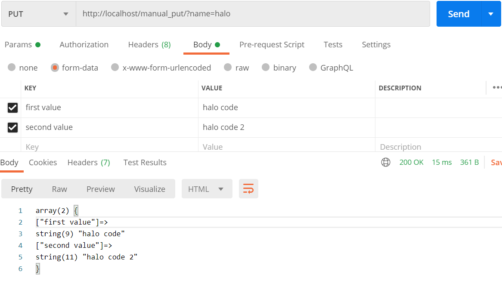

## Manual PUT in PHP

- Note !.<br />
  This code work only on body form-data(tested in postman)

- Start <br />
```
    // var_dump($keyVal['id']);
```
    uncoment this code ('id') with your key request ex :
    $keyVal['name'] or just use $keyVal for whole input body

    

- Thanks
    hope improve your code!
